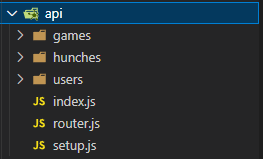
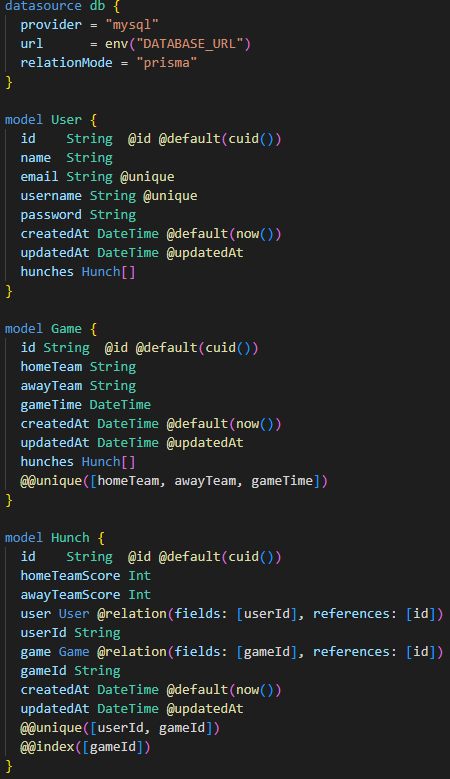
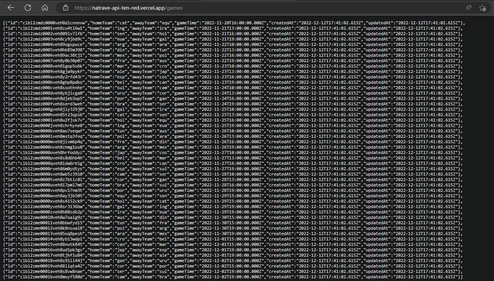

# NaTrave Full Stack Challenge Web

Projeto desenvolvido para estudo durante o evento Full Stack Challenge da [Codar.me](https://codar.me/).

## Getting Started with KoaJS

### `npm i`

### router.js

    import Router from "@koa/router";
    export const router = new Router();

    router.get("/", (req, res) => res.status(200).json({Server: "Running"}));

### setup.js

    import Koa from "koa";
    import bodyparser from "koa-bodyparser";
    import cors from "@koa/cors";
    import { router } from "./router.js";

    export const app = new Koa();
    app.use(cors());
    app.use(bodyparser());
    app.use(router.routes());
    app.use(router.allowedMethods());

### server.js || index.js

    import { app } from "./setup.js";
    app.listen(3000);

## Sobre 

O projeto consiste em uma aplicação de compartilhamento de palpites dos jogos da Copa do Mundo de 2022.

### BackEnd

API construída com o framework [KoaJS](https://koajs.com/) utilizando o [Prisma](https://www.prisma.io/) como ORM e [PlanetScale](https://planetscale.com/) como database MySQL.

Vale ressaltar que todo o projeto teve como principal base os vídeos da [Codar.me](https://codar.me/) com leves alterações.

O projeto serviu principalmente para reforçar meu entendimento sobre requisições e responses, tratamento e verificação de dados, uso de data model com Prisma, conexão com o banco de dados na nuvem, como funcionam as variáveis de ambiente e principalmente na realização de logins, logouts, validação do token de acesso criptografia básica.

## Routes

    router.get("/login", users.login);
    router.get("/users", users.getUsers);
    router.post("/users", users.createUser);
    router.delete("/users", users.deleteUser);

    router.get("/hunches", hunches.getHunches);
    router.post("/hunches", hunches.createHunch);
    router.delete("/hunches", hunches.deleteHunch);

    router.get("/games", games.getGames);

    router.get("/:username", hunches.getHunchesFromUser);

obs. `router.get("/users", users.getUsers);` é uma rota somente para desenvolvimento, portanto jamais poderá entrar em um ambiente de produção ou livre acesso.

## Database

